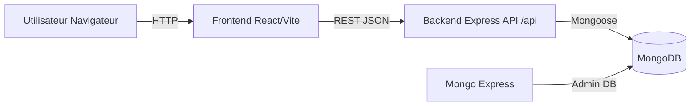
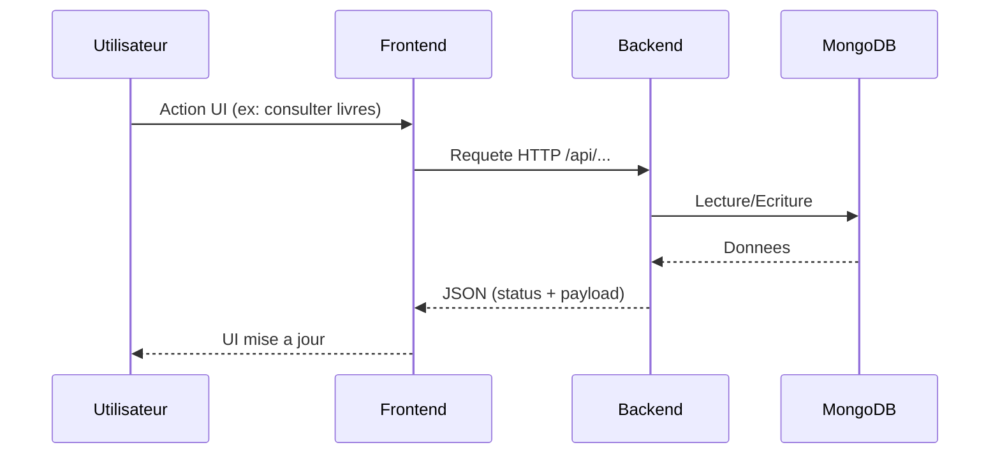
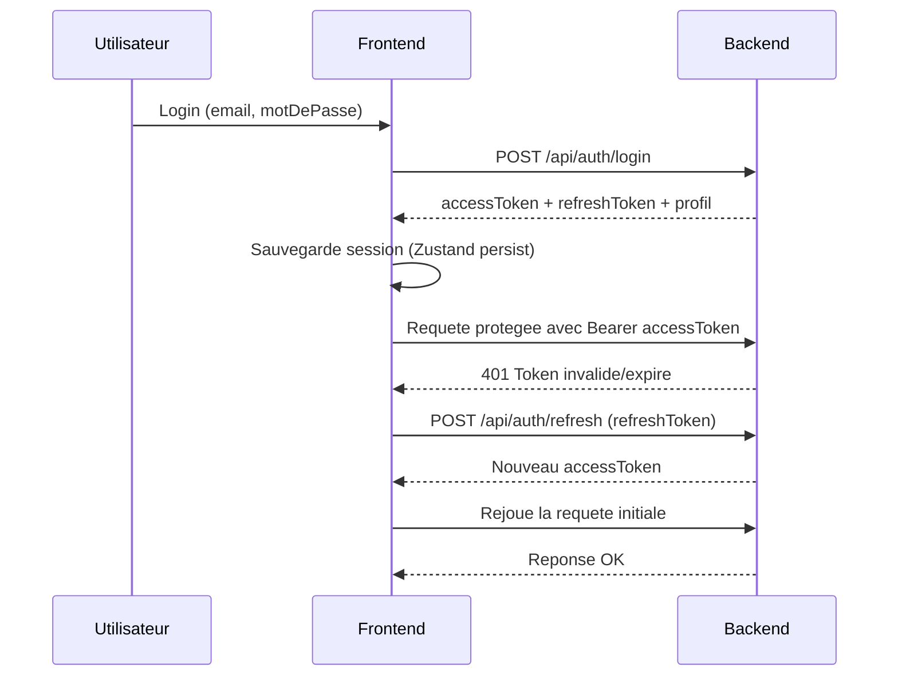
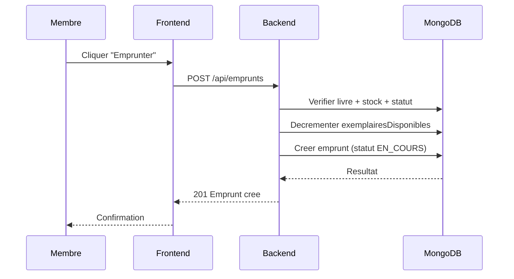

# Cloud Library Management System

Application web complete de gestion de bibliotheque:
- Frontend React/Vite
- Backend Node.js/Express
- Base de donnees MongoDB
- Orchestration Docker Compose
- CI GitHub Actions

Ce README explique le projet complet: architecture, modules, flux de communication, roles, lancement local, Docker, CI et checklist de deploiement.

## 1) Objectif du projet

Cloud Library permet de:
- consulter un catalogue de livres (meme en mode visiteur)
- gerer les utilisateurs et les roles (`ADMIN`, `BIBLIOTHECAIRE`, `MEMBRE`)
- gerer les categories et les livres
- emprunter et retourner des livres
- suivre les stocks (`quantite`, `exemplairesDisponibles`)

## 2) Stack technique

### Frontend
- React 19
- Vite 8
- React Router DOM 7
- Zustand (session auth)
- Axios (client HTTP + refresh token)
- CSS global (`Frontend/src/styles/globale.css`)

### Backend
- Node.js + Express
- Mongoose
- JWT (access + refresh tokens)
- Middlewares auth/roles
- Tests Jest + Supertest

### Infra
- Docker + Docker Compose
- MongoDB 7
- Mongo Express
- GitHub Actions CI

## 3) Architecture globale



## 4) Comment la communication circule dans le projet

### Vue generale des echanges



### Flux authentification + refresh token



### Flux emprunt de livre



## 5) Structure des dossiers

```text
cloud-library-management-system/
  Backend/
    src/
      app.js
      server.js
      config/
      controllers/
      middlewares/
      models/
      routes/
      test/
      utils/
    Dockerfile
    package.json
    README.md
  Frontend/
    src/
      api/
      composants/
      magasin/
      pages/
      styles/
      utils/
      App.jsx
      main.jsx
    public/
    Dockerfile
    package.json
    README.md
  .github/workflows/ci.yaml
  docker-compose.yml
  README.md
```

## 6) Backend en detail

### Modules principaux
- `controllers/`: logique metier de chaque domaine
- `routes/`: definition des endpoints
- `middlewares/`: `protect`, `authorizeRoles`
- `models/`: schemas Mongoose
- `utils/jwt.js`: generation/verification des tokens
- `test/`: tests unitaires/API avec mocks

### Modeles de donnees

#### Utilisateur
- `nom`
- `email` (unique)
- `motDePasse` (hash)
- `role` (`ADMIN`, `BIBLIOTHECAIRE`, `MEMBRE`)
- `isActive`

#### Categorie
- `nom` (unique)
- `description`
- `isActive`

#### Livre
- `titre`
- `auteur`
- `isbn` (unique)
- `categorie` (ref)
- `quantite`
- `exemplairesDisponibles`
- `isActive`

#### Emprunt
- `utilisateur` (ref)
- `livre` (ref)
- `dateEmprunt`
- `dateRetourPrevue`
- `dateRetourReelle`
- `statut` (`EN_COURS`, `RETOURNE`)

### Groupes de routes API
- `/api/auth`
- `/api/utilisateurs`
- `/api/categories`
- `/api/livres`
- `/api/emprunts`

Note:
- Un endpoint public existe pour les visiteurs: `GET /api/livres/public`
- Documentation API detaillee disponible dans [Backend/README.md](Backend/README.md)

## 7) Frontend en detail

### Modules principaux
- `pages/publiques/`: accueil, auth, support, livres publics
- `pages/privees/`: dashboard, profil, categories, livres, emprunts, utilisateurs
- `api/services/`: appels HTTP par domaine
- `magasin/authentification.js`: store Zustand (session)
- `composants/securite/RouteProtegee.jsx`: garde des routes privees
- `composants/navigation/`: navbar publique + layout prive

### Routage
- Routes publiques: `/`, `/connexion`, `/inscription`, `/nos-livres`, ...
- Routes privees: `/tableau-de-bord`, `/livres`, `/emprunts`, `/utilisateurs`, ...
- Protection par token + role via `RouteProtegee`

### Strategie auth dans le Front
- Access token ajoute automatiquement dans `Authorization` (interceptor Axios)
- Si 401: tentative automatique `POST /auth/refresh`
- Si refresh echoue: deconnexion + redirection vers `/connexion`

Documentation Front detaillee dans [Frontend/README.md](Frontend/README.md)

## 8) Roles et permissions

- `ADMIN`
  - acces complet
  - gestion utilisateurs
- `BIBLIOTHECAIRE`
  - gestion categories/livres/emprunts
  - pas de gestion utilisateurs admin
- `MEMBRE`
  - consultation catalogue
  - emprunts personnels
  - pas de CRUD admin

## 9) Lancement local (sans Docker)

### Backend
```bash
cd Backend
npm install
npm run dev
```

### Frontend
```bash
cd Frontend
npm install
npm run dev
```

## 10) Lancement avec Docker Compose

Depuis la racine:

```bash
docker-compose up --build
```

Services demarres:
- Frontend: `http://localhost:5173`
- Backend: `http://localhost:5000`
- MongoDB: `localhost:27017`
- Mongo Express: `http://localhost:8081`

## 11) Variables d environnement

### Backend (exemple)
```env
PORT=5000
MONGO_URI=mongodb://127.0.0.1:27017/cloud-library
JWT_SECRET=your_access_secret
JWT_REFRESH_SECRET=your_refresh_secret
JWT_EXPIRES_IN=15m
JWT_REFRESH_EXPIRES_IN=7d
CORS_ORIGIN=http://localhost:5173
```

### Frontend (exemple)
```env
VITE_API_URL=http://localhost:5000/api
```

## 12) Tests et qualite

### Backend
- Framework: Jest + Supertest
- Couverture actuelle: suites sur auth/utilisateurs/categories/livres/emprunts

Commande:
```bash
cd Backend
npm test -- --runInBand
```

### Frontend
- Lint ESLint

Commande:
```bash
cd Frontend
npm run lint
```

## 13) CI GitHub Actions

Workflow: [.github/workflows/ci.yaml](.github/workflows/ci.yaml)

Le pipeline execute:
- Job `backend`
  - install dependencies
  - tests backend
- Job `frontend`
  - install dependencies
  - lint frontend
  - build frontend

Triggers:
- push sur `main` et `dev`
- pull_request sur `main` et `dev`
- execution manuelle (`workflow_dispatch`)

## 14) Flux metier principaux (resume)

### 1. Visiteur consulte les livres
1. Front appelle `GET /api/livres/public`
2. Backend retourne uniquement les livres actifs
3. Front affiche la grille publique

### 2. Utilisateur se connecte
1. Front envoie `POST /api/auth/login`
2. Backend verifie email/mot de passe/etat actif
3. Backend renvoie tokens + profil
4. Front sauvegarde session et ouvre espace prive

### 3. Membre emprunte un livre
1. Front envoie `POST /api/emprunts`
2. Backend verifie disponibilite + statut livre
3. Backend decremente le stock disponible
4. Backend cree l emprunt
5. Front confirme l operation

### 4. Bibliothecaire retourne un livre
1. Front envoie `PATCH /api/emprunts/:id/retour`
2. Backend met statut `RETOURNE`
3. Backend incremente `exemplairesDisponibles`

## 15) Checklist pre-deploiement

- Backend tests verts
- Frontend lint vert
- Frontend build vert en CI
- Variables d environnement de prod configurees
- Secrets JWT non hardcodes dans Git
- CORS configure sur domaine frontend final
- Sauvegarde Mongo et monitoring prevus

## 16) Ressources utiles

- Doc API complete: [Backend/README.md](Backend/README.md)
- Doc Front complete: [Frontend/README.md](Frontend/README.md)

---

README racine maintenu pour donner une vue globale du projet complet et du flux de communication Frontend <-> Backend <-> MongoDB.
